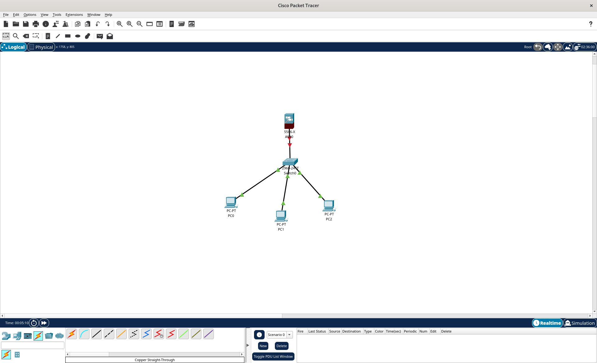

# Configuring Firewalls as DHCP Servers

## Topics covered
- How to Use a firewall as a DHCP


### Things you'll need to know before you start this
* [What is a Firewall?](https://github.com/mooroon/cookbooks/blob/main/Firewalls.md)

## Instructions

Download the project from here:

### 1. Create the following network
- Three PCs
- One Switch
- 5506 ASA Firewall




### 2. Go to CLI on the firewall
- Open Command Line Interface on your ASA


```cmd 

ciscoasa>enable
Password:

```

Here you will be asked for a password, just hit return as we haven't set one yet.

```cmd

ciscoasa#configure terminal
ciscoasa(config)#interface g1/1
ciscoasa(config-if)#ip address 10.13.10.13 255.255.255.0

```

Make sure the interface here matches the one you are using, next we will establish our protected network as internal and set its security level

```cmd

ciscoasa(config-if)#nameif INSIDE
ciscoasa(config-if)#security-level 100
ciscoasa(config-if)#exit

```

We are protecting some top secret stuff so we will set our security level to 100. Security levels on interfaces on the ASA are to define how much you trust traffic from that interface. Level 100 is the most trusted and 0 is the least trusted. 💯

Now we have set our firewall to MAXIMUM security we can also configure it as a DHCP server.

```cmd

ciscoasa(config)#dhcpd ?
ciscoasa(config)#dhcpd address 10.13.10.20-10.13.10.12 INSIDE

```
Just like setting up a typical server for DHCP we can state how big our IP pool address range is, because we are making a top secret, super elite network with only three computers I have only included three addresses in the pool.

We can also include DNS, so lets do that too! Make sure you use your ASA's IP

```cmd

ciscoasa(config)#dhcpd dns 10.13.10.13
ciscoasa(config)#dhcpd enable INSIDE
ciscoasa(config)#exit
ciscoasa#write memory

```
Congratulations! we have now set up our super security firewall to also act as a DHCP server, we are almsot finished but we haven't activated the interface yet, so remember to include:

```cmd

ciscoasa#configure terminal
ciscoasa(config)#interface g1/1
ciscoasa(config-if)#no shutdown
ciscoasa(config-if)#exit

```
Hopefully now your network will look like this, no red in sight. One last step:

```cmd

ciscoasa(config)#write memory

```

When your little yellow dot turns green we can test the DHCP.

### 3. Convert Ip addresses to DHCP
On each device go to Desktop and then to IP Configuration and ensure the congfiguration is set to DHCP rather than static. Do on all devices.

*insert images here*

### 4. test using command prompt
Choose any PC, it should work for any, and return to the Desktop, this time go to command prompt and attempt to ping.

```bash

C:\>ping 10.13.10.13

```
You should recieve replies if the network is successful.

###Hooray! You have completed this lesson and established a very secret and protected network :D
